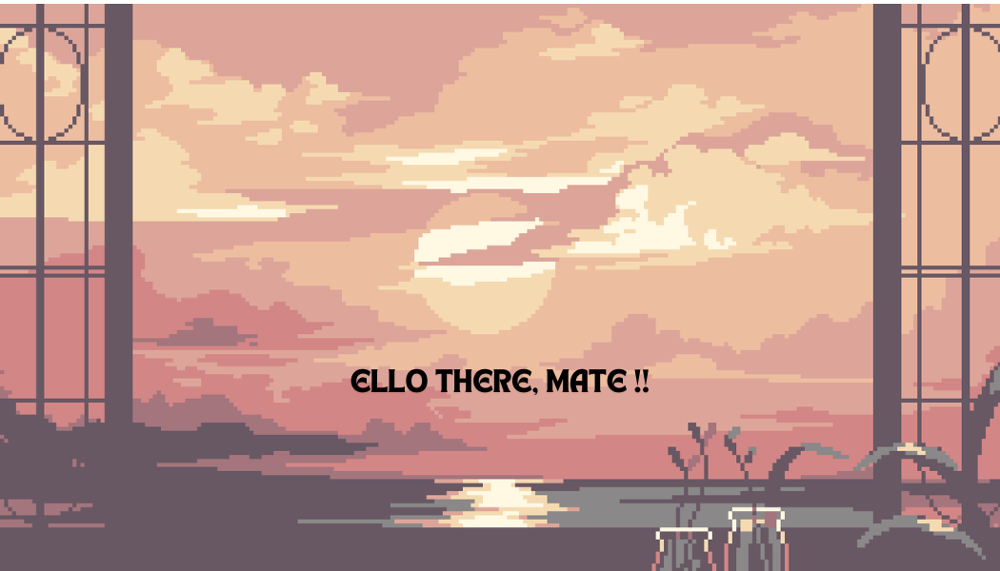

## GodSpeed🚀 

  

## Github Stats  

  

## My Skill Set  
<table><tr><td valign="top" width="33%">

### Frontend  

  
  
  
  
  
  
  
  
  

</td><td valign="top" width="33%">

### Backend  

  
  
  
  
  
  
  
  

</td><td valign="top" width="33%">

### DevOps  

  
  
  
  

</td></tr></table>  

   

## Connect with me  

<a href="https://linkedin.com/in/emmanuel-gudinho" target="_blank">

 
</a>  

  
  

   

  

   

## Recent Blog Posts  
[Revolutionize Learning with Smart Education System: Generative AI, Django, and PWA Integration.](https://medium.com/@emmanuelgudinho45/revolutionize-learning-with-smart-education-system-generative-ai-django-and-pwa-integration-b5024e6702e3)  
  

  
